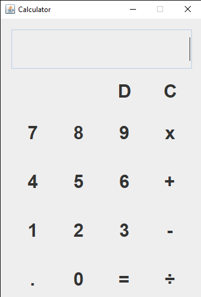

# Swing Calculator Application

A Simple java calculator application using java **Swing**, GUI toolkit for java. Allowing users perform basic arithmetic calculations such as addition, subtraction, division, multiplication

- Author: Bamisaye Emmanuel Oladimeji
- Matriculation no: U23CS1070
- Department: Computer Science
- Github acc: [@emmydigitaltech](https://github.com/emmydigitaltech)
- Calculator repo: [Swing Calculator](https://github.com/emmydigitaltech/Swing-Calculator-U23CS1070)

## Screenshot

